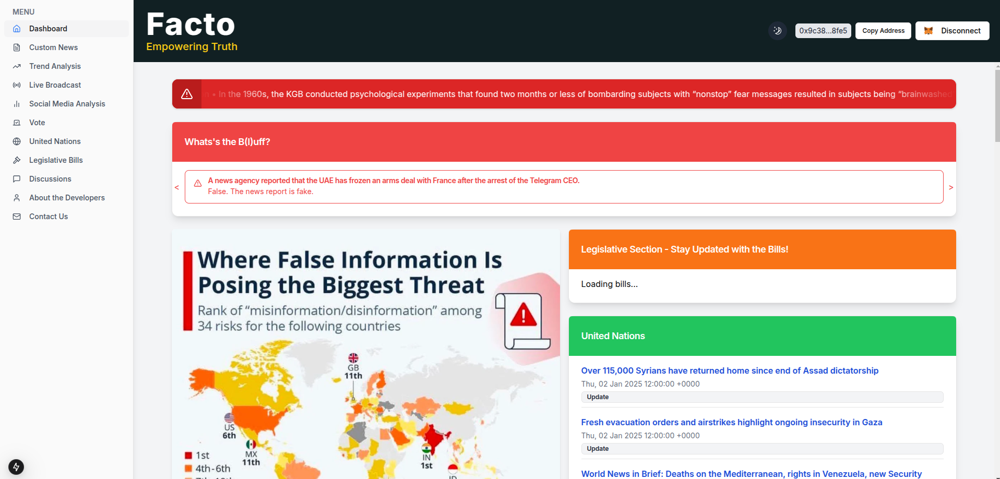
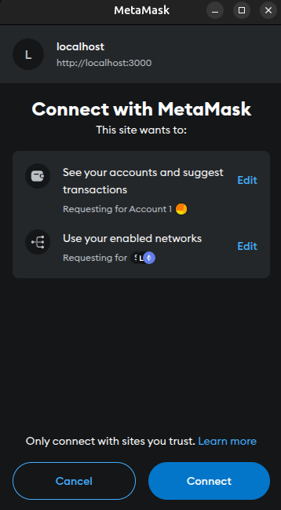
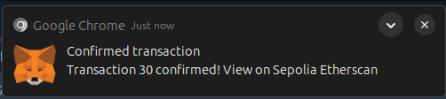
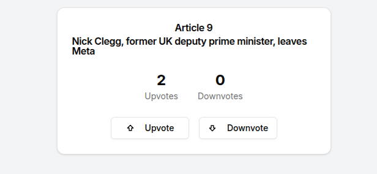
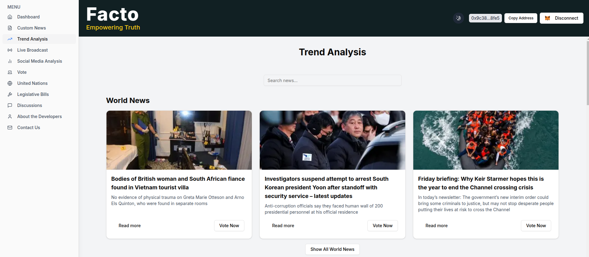
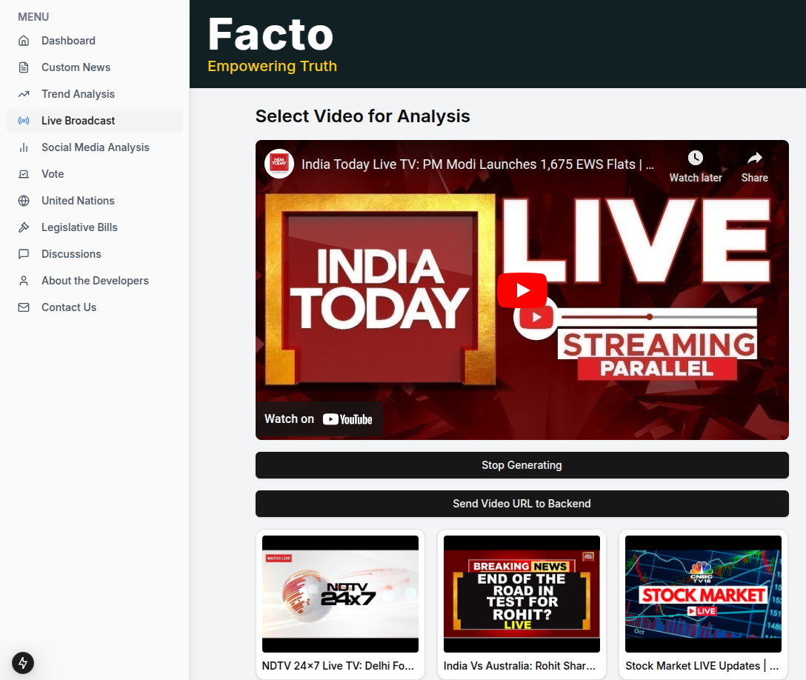
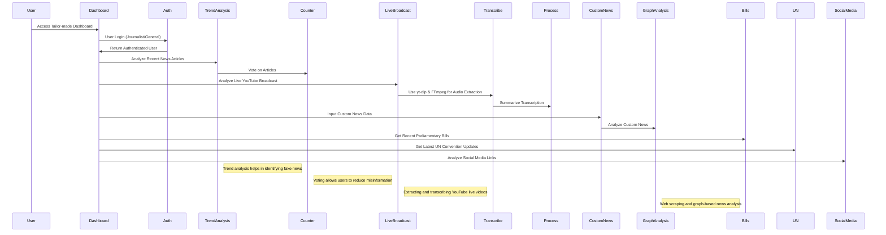

# Welcome to **Facto**!

**Facto** is a Real-Time Misinformation Detection and Verification System for Broadcast Media. It analyzes news from various sources in real-time, validates its credibility, and provides accurate information to users.

---



## Project Setup

### Prerequisites

Ensure that you have the following software installed before setting up the project:

- **Node.js** (v14 or later)
- **npm** (v6 or later)

#### Additional Notes

- This project uses shadcn/ui components. If you need to add more components, you can do so using the following command:

``npx shadcn@latest add [component-name]``

### Steps to Set Up the Project

1. **Clone the repository**:

```bash
   git clone https://github.com/vatsal-afk/facto.git
```

2. **Set up the Backend**:
   Navigate to the `@/streaming` :

```bash
   cd backend
   pip install -r requirements.txt
   gunicorn -w 4 -b 0.0.0.0:8000 app:app
```

3. **Set up the Frontend**:
   Navigate to the `@/frontend` directory:

```bash
   npm install
   npm run dev
```

## Configuration

To configure the project, create a `.env` file in the root directory with

`NEXT_PUBLIC_GUARDIAN_API_KEY=your_guardian_api_key NEXT_PUBLIC_YOUTUBE_API_KEY=your_youtube_api_key NEXT_PUBLIC_DEPLOYED_CONTRACT_ADDRESS=your_contract_address NEXT_PUBLIC_GOOGLE_API_KEY=your_google_api_key NEXT_PUBLIC_NEWS_API_KEY=your_news_api_key MONGODB_URI=your_mongodb_connection_uri NEXTAUTH_SECRET=your_nextauth_secret NEXTAUTH_URL=http://localhost:3000 NEXT_PUBLIC_GOOGLE_CUSTOM_SEARCH_ENGINE_ID=your_custom_search_engine_id REDDIT_CLIENT_ID=your_reddit_client_id REDDIT_CLIENT_SECRET=your_reddit_api_secret`

# Features

1. [Custom News Input for Verification](#1-fake-news-verification-model)
2. [Graphical Analysis of Custom News](#graphical-output)
3. [YouTube News Verification System](#2-live-news-verification-from-youtube)
4. [Voting for Verified Users](#how-to-become-a-verified-user)
5. [Discussion Forum for General Users](#how-to-join-the-discussion)
6. [Trending News and Social Media Insights](#webscraping-the-recent-news)

## How to Become a Verified User?

To improve the reliability and credibility of the platform, users can become **verified** based on their contributions, such as sharing news insights or engaging in discussions. This feature is designed for professionals or individuals who actively contribute to the platform’s goals.

### How to Become a Verified User ✅

To improve the reliability and credibility of the platform, users can become verified based on their contributions, such as sharing news insights or engaging in discussions. This feature is designed for professionals or individuals who actively contribute to the platform’s goals. 🌍

---

### Steps to Become Verified 🔑

1. **Sign Up** 📝:Visit the **Auth Page** and sign up as a general user.
2. **Submit Credentials** 📄:Provide documentation that confirms your professional background or contributions to specific news topics.
3. **Verification Review** 🔍:The verification team will assess your submission and confirm your status within a few days.
4. **Voting Access** 🗳️:
   After verification, you'll gain the ability to vote on news accuracy and contribute to the model’s evaluation.

---

### Benefits of Verification 🌟

- **Contribute Meaningfully** 🌐: Verified users can vote to determine whether news is real or fake.
- **Build Credibility** 🏆: Verified status enhances your recognition as a trustworthy participant.
- **Support Accuracy** 📊: Your verified status helps improve the quality of news verification.

---

### Voting feature:

For getting the feedback of the generalist and verified user we will have the voting feature for the verdict that is being generated by the server, and here is a quick walkthrough for that:



First you will connect to the metamask and login to get the blockchain server started then there will be the traction page appearing.



In the transaction page, once the transaction is completed you will be able to vote.



Just click on the upvote and downvote option to express your required sentiments.

## Web Scraping for Recent News



This feature collects and analyzes the latest news articles from reliable sources like The Guardian, Reddit, and News API. Using libraries like **BeautifulSoup** for HTML parsing, **Requests** for HTTP requests, and **praw** for accessing Reddit’s API, the platform retrieves diverse and up-to-date content. The data is then processed for analysis and insights, ensuring relevant news is always available for verification.

---

# About the Models

## 1. 📰Fake News Verification Model

This model verifies the authenticity of news by comparing custom inputs to trusted sources. It uses advanced **natural language processing (NLP)** and **embedding-based similarity** checks to assess the credibility of news claims.

### ✨Key Features:

- 🔗**Embedding-Based Comparison**: Compares news input embeddings with external sources to check for similarities.
- 📚**Fact Density**: Measures the factual depth of news to detect sensationalism.
- 🔤**Lexical Diversity**: Assesses vocabulary richness to flag repetitive or overly simplified language.
- 😊**Sentiment Analysis**: Evaluates emotional bias in the content, aiming for neutrality.
- 📖**Readability**: Ensures content is clear and not oversimplified.

### ⚙️How It Works:

1. ✍️**Input News**: Custom news input is provided.
2. 🧠**Embedding Extraction**: The input is transformed into embeddings.
3. 🔍**Similarity Check**: The model compares the embeddings to trusted sources.
4. 🔧**Refinement**: Additional parameters (fact density, sentiment, etc.) refine the decision.
5. ✅**Output**: The model returns a **credibility score** and a **verdict** (real or fake).

### 📊 Visual Output:

- Bar charts and interactive symbols display scores for each parameter, providing a clear visual summary of the news verification process.
- Knowledge graph for getting the sense out of the news.

---

## 🛠️ Models Used

| Feature                        | Models/Tools                                                                                                                                                    |
| ------------------------------ | --------------------------------------------------------------------------------------------------------------------------------------------------------------- |
| **Embedding Comparison** | [BERT](https://huggingface.co/bert-base-uncased), [RoBERTa](https://huggingface.co/roberta-base), [SBERT](https://huggingface.co/sentence-transformers/all-MiniLM-L6-v2) |
| **Fact Density**         | [T5](https://huggingface.co/t5-base), [GPT](https://platform.openai.com/docs/models/gpt-4), Google Knowledge Graph API                                                |
| **Lexical Diversity**    | [spaCy](https://spacy.io/), [TextBlob](https://textblob.readthedocs.io/en/dev/)                                                                                       |
| **Sentiment Analysis**   | [VADER Sentiment](https://github.com/cjhutto/vaderSentiment), [BERT-Sentiment](https://huggingface.co/nlptown/bert-base-multilingual-uncased-sentiment)               |
| **Readability Scoring**  | Flesch-Kincaid Readability Tests, Custom Algorithms                                                                                                             |

---

## 🎥 Live News Verification from YouTube

This repository contains a **Live News Verification Model** that processes YouTube videos to verify the authenticity of news. The model extracts audio, transcribes it, and analyzes the content in smaller, meaningful chunks to ensure accurate evaluation.



---

### 🚀 Features

- **🎵 Audio Extraction**Extract audio directly from YouTube videos using `youtube-dlp`.
- **📄 Whisper for Transcription**Convert audio to text with high accuracy using the **Whisper model**.
- **📝 News Chunking**Break transcribed text into smaller, context-specific chunks for efficient analysis.
- **❌✅ Fake News Classification**Analyze and classify news chunks as **real** or **fake** using trusted source comparison.
- **⏳ Timestamp Flexibility**
  Start analyzing from a specific timestamp for focused evaluations.

---

### 🛠️ Models and Tools Used

| Feature                            | Models/Tools                                                                                                           |
| ---------------------------------- | ---------------------------------------------------------------------------------------------------------------------- |
| **Audio Extraction**         | [youtube-dlp](https://github.com/yt-dlp/yt-dlp)                                                                           |
| **Audio Transcription**      | [Whisper](https://github.com/openai/whisper)                                                                              |
| **Embedding Comparison**     | [BERT](https://huggingface.co/bert-base-uncased), [RoBERTa](https://huggingface.co/roberta-base)                             |
| **Fake News Classification** | [SBERT](https://huggingface.co/sentence-transformers/all-MiniLM-L6-v2), [GPT](https://platform.openai.com/docs/models/gpt-4) |
| **Chunking & Analysis**      | [spaCy](https://spacy.io/), Custom Algorithms                                                                             |

---

### 📋 How It Works

1. **Input Video**: Upload the YouTube video URL to be analyzed.
2. **Audio Conversion**: Extract audio from the video using `youtube-dlp`.
3. **Audio Transcription**: Transcribe the extracted audio to text using the **Whisper model**.
4. **Content Chunking**: Split the transcription into smaller chunks for detailed analysis.
5. **Verification**: Compare each chunk with embeddings from trusted sources to classify news as **real** ✅ or **fake** ❌.
6. **Timestamp Selection**: Optionally select a starting timestamp for targeted analysis.

---

### 📊 Visual Outputs

- Detailed classification for each chunk with timestamps.
- Bar charts and credibility scores for visual summary.

## Flow of the project

Here is a detailed flowchart showing various routes:



### Thank You!

Developed by Vatsal, Vishesh, Tanmay and Aman 🚀
